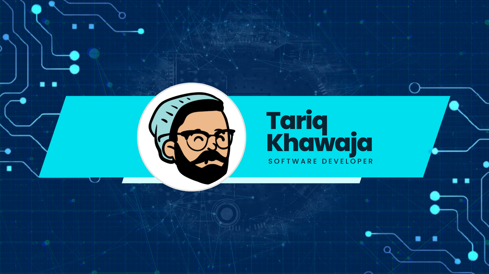
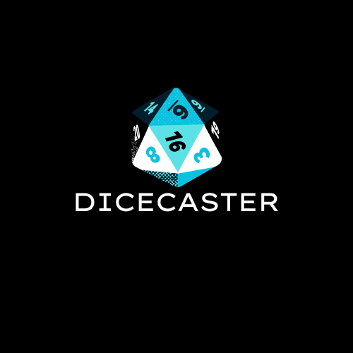
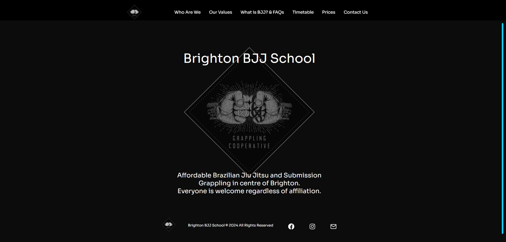

# Hi there, I'm Tariq ! 👋

## About Me 🚀

I'm a passionate **Full Stack Software Developer** with experience in
**JavaScript, React, Node.js, GraphQL**. I have a deep passion for learning new
skills, helping others to succeed, and solving problems in a creative way.

- 🌱 Currently learning: **Next.js, TypeScript, Vite**
- 🔭 Working on: **Dicecaster**
- 🌍 Languages: **JavaScript, TypeScript**
- 📫 How to reach me: **tariqkhawaja26@live.com**
- ⚡ Fun fact: **Outside of coding my hobbies include Brazilian Jiu Jitsu and tabletop roleplaying games.**

## My Skills 🧠

## Featured Projects 💻

### [Dicecaster](https://www.npmjs.com/package/dicecaster)

**Dicecaster** is a small npm package I made to roll dice for D&D. built with TypeScript and uses Jest for testing. Dicecaster has all the functionalities needed to roll dice for D&D. It can roll any normal set of polyhedral dice you would use for the game as well as methods for rolling with advantage and disadvantage. It is built with a Test Driven Development approach and the package is published on npm. You can check out the repository
[here](https://github.com/tariqtkhawaja/dicecaster) as well as the
[Documentation](https://tariqtkhawaja.github.io/dicecaster/)

### [Brighton BJJ School](https://brightonbjj.co.uk/)

**Brighton BJJ School** is a Brazilian Jiu-Jitsu school in Brighton, UK. The website is built with React and uses styled-components for styling. It is hosted on Netlify. This project was my first freelance client project and taught me alot about React and styled-components as well as working with the Google Maps
API You can check out the repository
[here](https://github.com/tariqtkhawaja/brightonbjjschool).

## Get in Touch 📬

- [Personal Website/Blog](https://tariqkhawaja.dev/)
- [LinkedIn](https://www.linkedin.com/in/tariq-khawaja-a8334184/)
- [Twitter](https://twitter.com/tariqtkhawaja)
